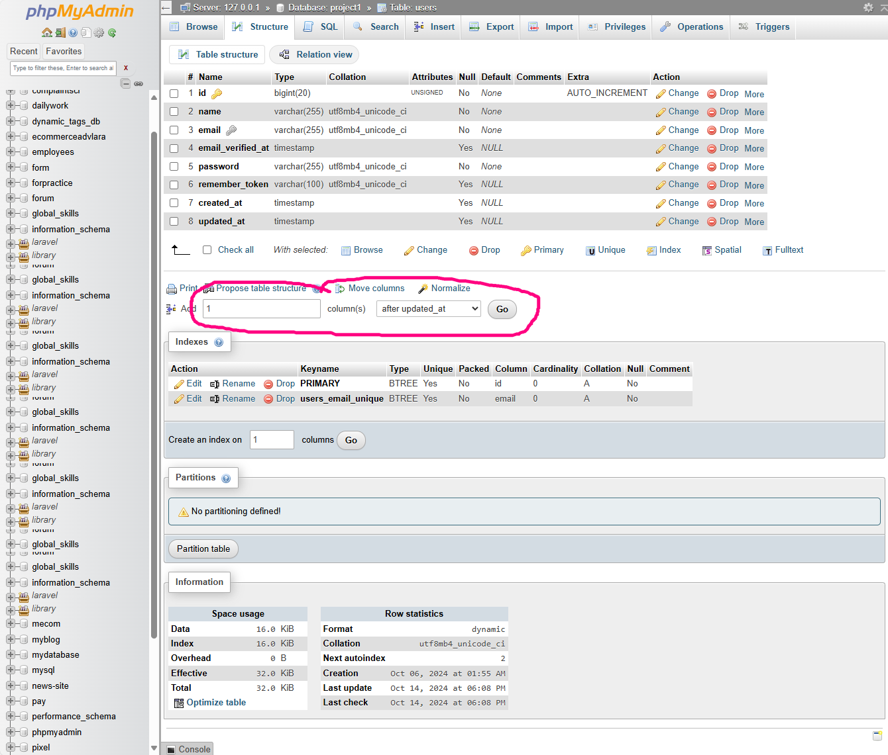
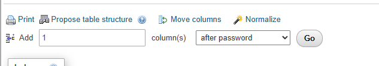
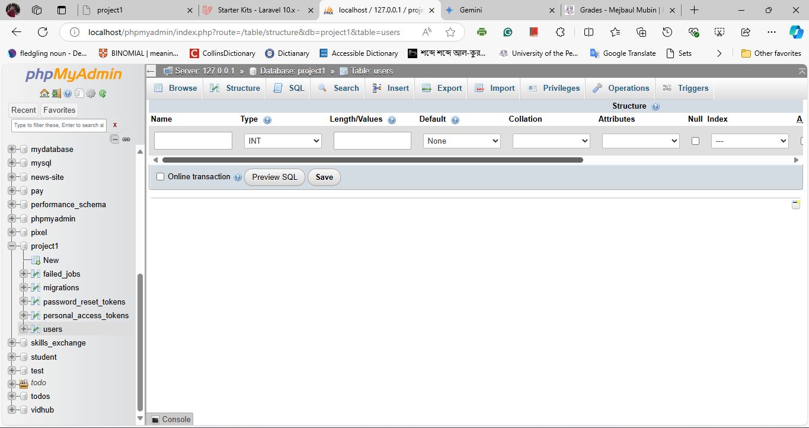
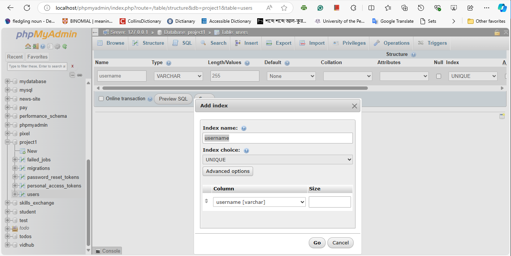
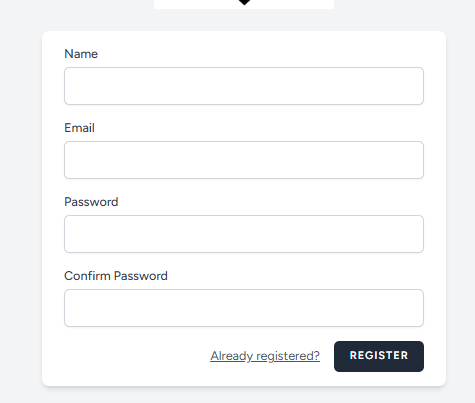

হ্যালো বন্ধুরা। আবার স্বাগতম। আমাদের আগের ভিডিওতে আমরা সফলভাবে আমাদের ইমেজ আপডেট করেছিলাম, যেখানে ডিফল্ট ইমেজটি আমরা নতুন ইমেজ দিয়ে প্রতিস্থাপন করেছিলাম, যা পুরোপুরি ঠিকঠাক কাজ করেছে। এই ভিডিওতে আমি আলোচনা করতে চাই কিভাবে আমরা username দিয়ে লগইন করতে পারি। ঠিক আছে, ডিফল্টভাবে তারা ইমেজ ব্যবহার করছে এবং পাসওয়ার্ড দিয়ে লগইন করছে। আমরা ইতিমধ্যেই ইমেইল অ্যাড্রেস এবং পাসওয়ার্ড দিয়ে লগইন করার বিষয়ে আলোচনা করেছি, যা কাজ করেছে।
এখন যদি আমরা আমাদের রেজিস্টার পৃষ্ঠায় যাই, সেখানে ডিফল্টভাবে নাম, ইমেইল, পাসওয়ার্ড এবং পাসওয়ার্ড কনফার্মেশন রয়েছে। এখন এখানে আমি আরেকটি নতুন ফিল্ড যোগ করতে চাই, যেটি হবে username, এবং আমাদের ডাটাবেজেও এটি আপডেট করতে হবে, কারণ আমাদের ডাটাবেজে username ফিল্ড নেই। আমরা নামটি ব্যবহার করতে পারতাম, কিন্তু আমি আলাদাভাবে username ব্যবহার করতে চাই, যা আমাদের জন্য ভাল হবে।
আমরা যখন মাইগ্রেশন চালাই, এটি স্বয়ংক্রিয়ভাবে আপডেট হবে এবং একটি নতুন username ফিল্ড তৈরি হবে। আমি ইতিমধ্যে একটি মাইগ্রেশন তৈরি করেছি, আপনি চাইলে নতুনভাবে মাইগ্রেট করতে পারেন, তখন এটি স্বয়ংক্রিয়ভাবে তৈরি হবে এবং username ফিল্ড যোগ করা হবে।

```php
//2014_10_12_000000_create_users_table
<?php

use Illuminate\Database\Migrations\Migration;
use Illuminate\Database\Schema\Blueprint;
use Illuminate\Support\Facades\Schema;

return new class extends Migration
{
    /**
     * Run the migrations.
     */
    public function up(): void
    {
        Schema::create('users', function (Blueprint $table) {
            $table->id();
            $table->string('name');
            $table->string('email')->unique();
            $table->string('username')->unique();
            $table->timestamp('email_verified_at')->nullable();
            $table->string('password');
            $table->rememberToken();
            $table->timestamps();
        });
    }

    /**
     * Reverse the migrations.
     */
    public function down(): void
    {
        Schema::dropIfExists('users');
    }
};
```

আমি এটিকে ইউনিক (অনন্য) করব যাতে এটি একই ডাটাবেজে অন্য কোথাও পুনরায় না থাকে।
এখন আমি আমাদের ডাটাবেজে যাই। আমি ডাটাবেজে গিয়ে এর স্ট্রাকচার (কাঠামো) দেখতে চাই।



আমি পাসওয়ার্ড ফিল্ডের পরে একটি নতুন ফিল্ড তৈরি করব। আমি এটি পাসওয়ার্ডের পরেই তৈরি করতে চাই এবং এর নাম দেব username। আমি এটি মার্কার ফিল্ড হিসেবে তৈরি করব এবং এটি ইউনিক হবে। আমি এটিকে ২৫৫ দৈর্ঘ্যের তৈরি করেছি এবং নালেবল (nullable) করেছি, যাতে ফিল্ডটি খালি থাকতে পারে এবং এটি ইউনিকও থাকবে।


এরপর এটি সেভ করি, এবং এখন আমাদের নতুন ফিল্ড যোগ হয়েছে, আপনি দেখতে পাবেন পাসওয়ার্ডের পরেই username ফিল্ড যোগ হয়েছে। usernameও ইউনিক এবং ইমেইলও ইউনিক, যা সম্পূর্ণ ঠিকঠাক কাজ করছে।

এরপর যদি আমরা আমাদের রেজিস্টার পৃষ্ঠায় যাই, সেখানে username ফিল্ড দেখতে পাবেন না,

তাই আমাদের সেই ফাইলটি খুঁজে বের করতে হবে। আমি আপনাকে আগেও বলেছি, এই ফাইলটি আমাদের ভিউ (view) এর পর (auth) ফোল্ডারে register.blade.php নামে আছে। আমরা সেখানে গিয়ে এই রেজিস্টার ফর্মটি সম্পাদনা করব। আমি সেখানে নাম ফিল্ডটি কপি করব এবং তারপর এটিকে username হিসেবে ব্যবহার করব।

```php
//view/auth/register.blade.php
<!-- Name -->
        <div>
            <x-input-label for="name" :value="__('Name')" />
            <x-text-input id="name" class="block mt-1 w-full" type="text" name="name" :value="old('name')" required autofocus autocomplete="name" />
            <x-input-error :messages="$errors->get('name')" class="mt-2" />
        </div>
```

ফর্মের ইনপুট ফিল্ডে আমি username সেট করব, নাম হবে username এবং টাইপ হবে টেক্সট। আমি এটিকে আপডেট করে সেভ করি।

```php
 <!-- UserName-->
        <div>
            <x-input-label for="name" :value="__('Username')" />
            <x-text-input id="username" class="block mt-1 w-full" type="text" name="username" :value="old('username')" required autofocus autocomplete="name" />
            <x-input-error :messages="$errors->get('name')" class="mt-2" />
        </div>
```

এখন যদি আপনি পৃষ্ঠাটি রিফ্রেশ করেন, তাহলে দেখতে পাবেন username ফিল্ড যোগ হয়েছে। আমি এটিতে একটু স্টাইলিং যোগ করতে চাই, যেন এটি আরও সুন্দর দেখায়। আমি সেখানে কিছু মার্জিন যোগ করি। এর জন্য class="mt-4" ব্যবহার করলে `<div class="mt-4">' চলবে। এখন এটি আরও ভালোভাবে প্রদর্শিত হচ্ছে।
এখন আপনি যখন রেজিস্টার করেন বা একটি রেজিস্টার করেন তখন ঠিক কি জিনিসগুলি এখানে ঘটছে যা ডিফল্টভাবে হয়

```php
//view/auth/register.blade.php
<form method="POST" action="{{ route('register') }}">
```

রেজিস্টারের বাইরে আমি ইতিমধ্যেই আপনার সাথে সেই বিষয়গুলি সম্পর্কে আলোচনা করেছি যদি আপনি আমাদের রুট তালিকায় যান

```bash
PS C:\Users\mejba\OneDrive\Desktop\GitHub\Laravel-Big-Project\Laravel-Big-Project\basic> php artisan route:list

  GET|HEAD  register ................................................................................................................................................... register › Auth\RegisteredUserController@create
  POST      register ............................................................................................................................................................... Auth\RegisteredUserController@store
  POST      reset-password ........................................................................................................................................... password.store › Auth\NewPasswordController@store
  GET|HEAD  reset-password/{token} .................................................................................................................................. password.reset › Auth\NewPasswordController@create
  GET|HEAD  sanctum/csrf-cookie ...................................................................................................................... sanctum.csrf-cookie › Laravel\Sanctum › CsrfCookieController@show
  GET|HEAD  verify-email .................................................................................................................................. verification.notice › Auth\EmailVerificationPromptController
  GET|HEAD  verify-email/{id}/{hash} .................................................................................................................................. verification.verify › Auth\VerifyEmailController
```

এবং রেজিস্টার আসলে কাজ করছে `Auth\RegisteredUserController` এখন, আপনি যদি আমাদের auth-এ যান, আপনি দেখতে পাবেন যে এটি HTTP কন্ট্রোলার auth, যা আমাদের `RegisteredUserController.php`।

```php
// App\Http\Controllers\Controller\RegisteredUserController.php
$request->validate([
            'name' => ['required', 'string', 'max:255'],
            'email' => ['required', 'string', 'lowercase', 'email', 'max:255', 'unique:'.User::class],
            'password' => ['required', 'confirmed', Rules\Password::defaults()],
        ]);
```

রেজিস্টার করার সময় আমাদের এখন username ফিল্ডটিও ব্যবহার করতে হবে। এজন্য আমাদের রেজিস্টার কন্ট্রোলারে যেতে হবে এবং সেখানে username ফিল্ডটিও যুক্ত করতে হবে।

```php
// App\Http\Controllers\Controller\RegisteredUserController.php
public function store(Request $request): RedirectResponse {
        $request->validate([
            'name' => ['required', 'string', 'max:255'],
            'username' => ['required', 'string', 'lowercase', 'max:255', 'unique:' . User::class], // new added
            'email' => ['required', 'string', 'lowercase', 'email', 'max:255', 'unique:' . User::class],
            'password' => ['required', 'confirmed', Rules\Password::defaults()],
        ]);
```

এর পর

```php
// App\Http\Controllers\Controller\RegisteredUserController.php
$user = User::create([
            'name' => $request->name,
            'email' => $request->email,
            'password' => Hash::make($request->password),
        ]);
```

```php
// App\Http\Controllers\Controller\RegisteredUserController.php
$user = User::create([
            'name' => $request->name,
            'username' => $request->username,
            'email' => $request->email,
            'password' => Hash::make($request->password),
        ]);
```

আমরা রিকোয়েস্ট থেকে username গ্রহণ করব এবং এটি ব্যবহারকারীর ডাটাবেজ টেবিলে সংরক্ষণ করব।
এখন আমি রেজিস্টার ফর্মে টেস্ট বা ডেমো ব্যবহার করে দেখি এটি কাজ করছে কিনা। রেজিস্ট্রেশন সফলভাবে হয়েছে, এবং এখন আমাদের ইমেইল যাচাই করতে হবে। ইমেইল যাচাই করার পরে আপনি ড্যাশবোর্ডে অ্যাক্সেস পাবেন। ড্যাশবোর্ডে username প্রদর্শিত হচ্ছে, এবং আপনি দেখতে পাচ্ছেন সবকিছু ঠিকমতো কাজ করছে।
তবে আমাদের মডেলে এখনও username যুক্ত করা হয়নি, তাই এটি ডাটাবেজে সংরক্ষণ হচ্ছে না। আমাদের ইউজার মডেলে ফিলেবল অ্যাট্রিবিউটে username যোগ করতে হবে, যাতে এটি ডাটাবেজে ঠিকভাবে সংরক্ষণ হয়।
এখন আবার চেষ্টা করি। এবার রেজিস্ট্রেশন করলে আপনি দেখতে পাবেন username সঠিকভাবে ডাটাবেজে সংরক্ষণ হচ্ছে। এবার আমাদের লগইন পৃষ্ঠাতেও username ব্যবহার করতে হবে।
লগইন ফর্মে ইমেইল অ্যাড্রেসের পরিবর্তে username যুক্ত করি। এরপর আমাদের কন্ট্রোলারে গিয়ে লগইন প্রক্রিয়ায় username ব্যবহার করার জন্য নিয়ম (রুলস) আপডেট করতে হবে। আমি এখানে ইউজারনেমের জন্য প্রয়োজনীয় নিয়ম (রুল) সেট করেছি। এরপর এটি ব্যবহারকারীকে সঠিকভাবে যাচাই করবে এবং লগইন করাবে।
এখন আমি ডেমো username এবং পাসওয়ার্ড ব্যবহার করে লগইন করি এবং দেখতে পাচ্ছি, username দিয়ে সফলভাবে লগইন হচ্ছে। লগআউটও সঠিকভাবে কাজ করছে।
এখন যদি নতুন ব্যবহারকারী রেজিস্টার হয়, তাহলে username ডাটাবেজে সঠিকভাবে সংরক্ষিত হবে। পুরনো ব্যবহারকারীদের জন্যও username ম্যানুয়ালি যোগ করা যাবে।
এখন ডেমো ইউজার দিয়ে আবার লগইন করি এবং এটি ঠিকমতো কাজ করছে। আমরা সফলভাবে username দিয়ে লগইন এবং রেজিস্ট্রেশন প্রক্রিয়া সম্পন্ন করেছি।
এই ভিডিওতে আমরা সফলভাবে আমাদের ব্রিজ অথেনটিকেশন সিস্টেমে username যোগ করেছি। পরবর্তী ভিডিওতে আমরা আরও নতুন বিষয় নিয়ে আলোচনা করব। ধন্যবাদ।

```

```
